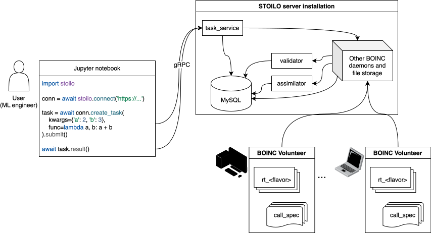
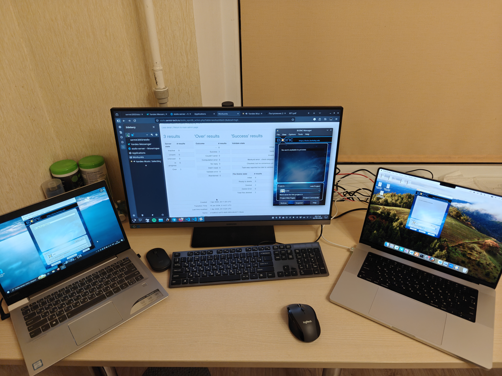
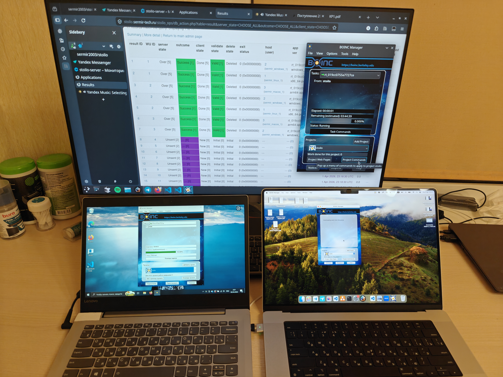
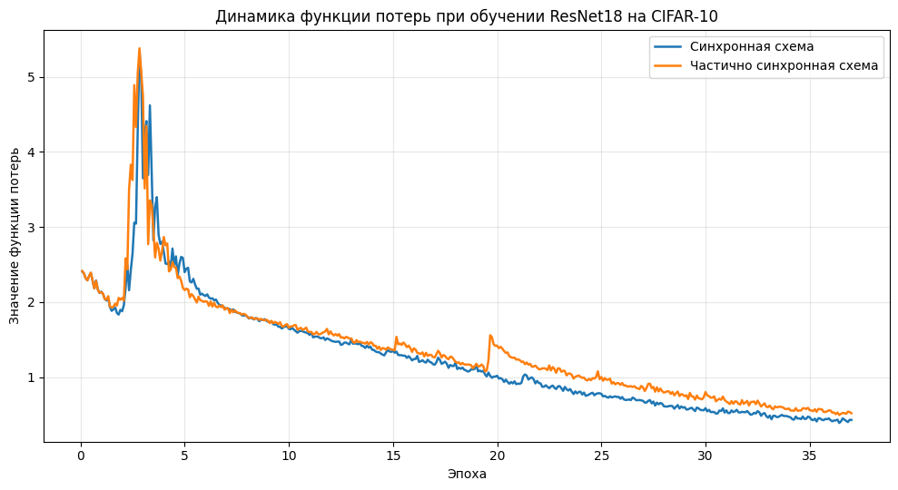
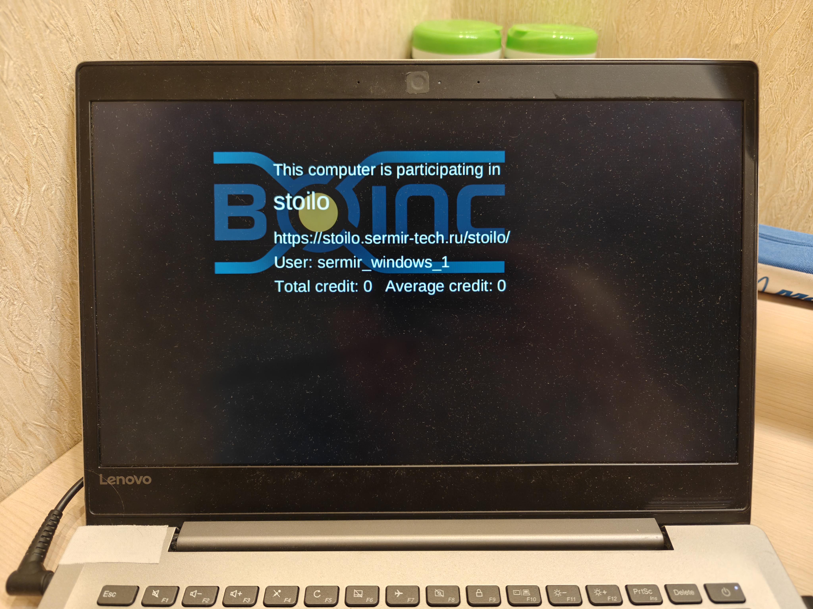

<!-- _class: title -->
<!-- _paginate: false -->


<div>

<div class="subtitle">Python-слой над BOINC для распределённого ML</div>

# Гибкий фреймворк распределённого глубинного обучения в среде добровольных вычислений

<div class="author">
<b>Миронов Сергей Дмитриевич</b><br/>
НИУ ВШЭ ФКН ПМИ<br/>
2026
</div>

</div>

---

<span class="kicker">Контекст</span>

# Добровольные вычисления и BOINC

<div class="context-grid">
<div>
<div class="context-lead">
Добровольные вычисления используют недоиспользованные ресурсы обычных устройств для научных задач.
</div>

<ul class="context-list">
<li>участники предоставляют ресурсы безвозмездно;</li>
<li>среда гетерогенна и географически распределена;</li>
<li>BOINC стал де-факто стандартом таких систем;</li>
<li>BOINC берёт на себя планирование, доставку данных, клиентское ПО и репликацию.</li>
</ul>
</div>

<div class="example-box">
Успешные проекты:<br/>
<b>SETI@home</b><br/>
<b>Rosetta@home</b><br/>
<b>Folding@home</b>
</div>
</div>

---

<span class="kicker">Предшественники</span>

# Существующие решения и незакрытая ниша

<div class="compare-grid4">
<div class="compare-card">
<div class="compare-title">MLC@Home, dDM</div>
<div class="check">BOINC применялся</div>
<div class="check">достигнуты результаты</div>
<div style="height: 9px"></div>
<div class="bad">код модели фиксирован</div>
<div class="bad">нет гибкого API</div>
</div>

<div class="compare-card">
<div class="compare-title">Atre и др.</div>
<div class="check">DDL поверх BOINC</div>
<div class="check">TensorFlow API</div>
<div style="height: 9px"></div>
<div class="bad">код не опубликован</div>
<div class="bad">нельзя развить или использовать</div>
</div>

<div class="compare-card">
<div class="compare-title">PyMW</div>
<div class="check">Python master-worker</div>
<div class="check">BOINC-интерфейс</div>
<div style="height: 9px"></div>
<div class="bad">deprecated с 2013 года</div>
<div class="bad">Python-окружение не настраивается</div>
</div>

<div class="compare-card orange">
<div class="compare-title">STOILO</div>
<div class="check">Python-задачи</div>
<div class="check">произвольное окружение</div>
<div class="check">простой деплой</div>
<div class="check">ML-обёртки</div>
<div class="badge">★ впервые вместе</div>
</div>
</div>

---

<span class="kicker">Архитектура</span>

# Уровни системы и граница вклада

<div class="layer-stack">
<div class="layer ml">
  <div class="name">ML-обёртки</div>
  <div class="items"><span>Sync DP</span><span>Stale-Sync</span><span>PyTorch API</span></div>
  <div class="layer-tag mine">мой<br/>вклад</div>
</div>
<div class="layer-arrow" style="color: var(--green);">↑</div>
<div class="layer infra">
  <div class="name">Инфраструктура STOILO</div>
  <div class="items"><span>Python-задачи</span><span>runtime-сборки</span><span>сервер</span><span>валидация</span></div>
  <div class="layer-tag mine">мой<br/>вклад</div>
</div>
<div class="layer-arrow" style="color: var(--orange);">↑</div>
<div class="layer boinc">
  <div class="name">BOINC</div>
  <div class="items"><span>планирование</span><span>клиент</span><span>доставка</span><span>репликация</span></div>
  <div class="layer-tag ready">готовая<br/>платформа</div>
</div>
</div>

---

<!-- _class: overview-slide -->

<span class="kicker">Общая схема</span>

# Обзорная диаграмма STOILO




---

<!-- _class: code-small -->

# Минимальный пользовательский API

<div class="two-col wide-left top">
<div>

```python
import stoilo

conn = await stoilo.connect("stoilo.sermir-tech.ru/stoilo:57010")

task = conn.create_task(
    kwargs={'a': 2, 'b': 3},
    func=lambda a, b: a + b,
)
task = await task.submit()
await task.result()  # 5
```

</div>
<div>

<div class="check">Callable передаётся как задача</div>
<div class="check">результат ждётся асинхронно</div>
<div class="check">задачи можно комбинировать</div>
<div class="check">BOINC скрыт за API</div>

</div>
</div>

<div class="flow compact">
<div class="flow-card">Python<br/>Callable</div>
<div class="flow-arrow">→</div>
<div class="flow-card orange">STOILO<br/>server</div>
<div class="flow-arrow">→</div>
<div class="flow-card">BOINC<br/>workunit</div>
<div class="flow-arrow">→</div>
<div class="flow-card green">Volunteer<br/>result</div>
</div>

<div class="chip-row">
<span class="chip">gRPC Create/Poll</span>
<span class="chip orange">cloudpickle input</span>
<span class="chip green">JSON result</span>
<span class="chip cyan">asyncio composition</span>
</div>

---

<!-- _class: code-small -->

# Репликация и валидация

<div class="two-col code66 top">
<div>

```python
await conn.create_task(
    kwargs=dict(a=1, b=-3, c=2),
    func=quadratic_roots_harmonic_mean,
    init_valid_func=lambda res: res is None or isinstance(res, float),
    compare_valid_func=lambda x, y: (
        x is None and y is None
        or x is not None and y is not None and abs(x - y) < 1e-6
    ),
    redundancy_options=stoilo.redundancy.CreateOptions(
        min_quorum=3,
        max_total_results=5,
    ),
).result()
```

</div>
<div>

<div class="check">BOINC реплицирует работу</div>
<div class="check">пользователь задаёт кворум</div>
<div class="check">валидаторы сравнивают ответы</div>
<div class="check">JSON снижает риск атак десериализации</div>

<div class="callout orange small" style="margin-top: 20px;">Недоверенная среда учитывается явно.</div>

</div>
</div>

---

<!-- _class: code-micro -->

# Параллельность и комбинаторы

<div class="two-col wide-left top">
<div>

```python
async def integrate_distributed(conn, f, a, b):
    def worker(x_0, x_n, n, f):
        h = (x_n - x_0) / n
        return h * (
            .5 * (f(x_0) + f(x_n))
            + sum(f(x_0 + j*h) for j in range(1, n))
        )

    step = (b - a) / 10
    tasks = [
        conn.create_task(
            kwargs={
                'x_0': a+i*step,
                'x_n': a+(i+1)*step,
                'n': 1000,
                'f': f,
            },
            func=worker,
        ) for i in range(10)
    ]
    return sum(await asyncio.gather(*(t.result() for t in tasks)))
```

</div>
<div>

<div class="check">привычные средства asyncio</div>
<div class="check">задачи можно параллелить</div>
<div class="check">можно строить сложные сценарии</div>

</div>
</div>

---

# Почему нужны среды исполнения

<div class="two-col top">
<div>

## Модель BOINC

1. клиент просит задания;
2. клиент скачивает приложение и файлы;
3. приложение кэшируется;
4. одно приложение — много задач.

</div>
<div>

## Проблема Python

- Python может отсутствовать;
- версии библиотек различаются;
- сеть у узла ограничена;
- всё нужно упаковать заранее.

</div>
</div>

<div class="callout orange" style="margin-top: 28px;">
Нужно сохранить модель BOINC, но добавить Python-зависимости.
</div>

---

<span class="kicker">Вторые три уровня</span>

# Среды исполнения Python

<div class="runtime-grid">
<div class="runtime-stack">
  <div class="runtime-box">
    <div class="icon">{}</div>
    <div>
      <div class="title">Спецификация Python-окружения</div>
      <div class="sub">версия Python, состав и версии библиотек</div>
      <div class="desc">описание можно менять при сохранении уникальности flavor</div>
    </div>
  </div>
  <div class="runtime-down">↓</div>
  <div class="runtime-box orange">
    <div class="icon">$_</div>
    <div>
      <div class="title">Вариант среды исполнения</div>
      <div class="sub"><code>rt_&lt;flavor&gt;</code></div>
      <div class="desc">ID окружения используется при создании задач</div>
    </div>
  </div>
  <div class="runtime-down" style="color: var(--orange);">↓</div>
  <div class="runtime-box green">
    <div class="icon">▦</div>
    <div>
      <div class="title">Сборка под платформу</div>
      <div class="sub"><code>rt_&lt;flavor&gt;_&lt;version&gt;_&lt;platform&gt;</code></div>
      <div class="desc">бинарный файл для конкретной ОС и архитектуры</div>
    </div>
  </div>
</div>

<div>
<div class="runtime-bullets">
<div>для разных платформ — разные сборки</div>
<div>обновления выходят независимо</div>
<div>новые варианты добавляются без остановки сервера</div>
<div>BOINC-кэширование сохраняется</div>
</div>
<div class="callout small" style="margin-top: 20px;">Одно приложение используется во многих задачах.</div>
</div>
</div>

---

<!-- _class: code-small -->

# Runtime собирается автоматически

<div class="runtime-build">
<div>

```json
{
  "python_version": "3.12.3",
  "cloudpickle_version": "3.1.1",
  "requirements": ["numpy==2.2.5"],
  "modules": ["numpy"]
}
```

<div class="chip-row">
<span class="chip">канонический JSON</span>
<span class="chip orange">SHA-256 flavor</span>
</div>

</div>
<div>

```bash
./rt_builder.py \
  --runtime-spec numpy.json \
  --base-python ~/.pyenv/versions/3.12.3 \
  --version 1.0 \
  --platform arm64-apple-darwin
```

<div class="chip-row">
<span class="chip green">venv</span>
<span class="chip green">зависимости</span>
<span class="chip green">бинарь</span>
</div>

</div>
</div>

<div class="callout green" style="margin-top: 16px;">Сборки добавляются без остановки сервера.</div>

---

<!-- _class: code-tiny -->

# Пример задачи с NumPy-runtime

<div class="numpy-layout">
<div>

```python
def solve_linear_system(A, b):
    import numpy as np
    return np.linalg.solve(A, b).tolist()

import numpy as np

A = np.array([[ 3,  1,  2], [ 1,  4,  0], [ 2,  0,  5]], dtype=float)
b = np.array([1, 2, 3], dtype=float)
task = conn.create_task(
    kwargs={'A': A, 'b': b},
    func=solve_linear_system,
    flavor='24a6681344294774',
    init_valid_func=lambda x: isinstance(x, list) and len(x) == 3
                              and all(isinstance(elem, float) for elem in x),
    compare_valid_func=lambda x, y: all(
        abs(elem_x - elem_y) < 1e-6
        for elem_x, elem_y in zip(x, y)
    ),
)
await task.result()
```

</div>
<div>

<div class="check">flavor задаёт среду с NumPy</div>
<div class="check">ограниченные требования к узлам</div>
<div class="check">результат JSON-сериализуем</div>
<div class="check">серверу не нужен NumPy</div>

</div>
</div>

---

<span class="kicker">Инсталляция</span>

# Инсталляция сервера

<div class="deploy-lead">
STOILO - развёртываемый продукт, а не централизованный сервис.
</div>

<div class="deploy-grid">
<div class="deploy-card">
<h3>Docker-образ сервера</h3>
<p>дожидается БД, создаёт BOINC-проект, регистрирует приложения, поднимает веб-интерфейсы и демоны;</p>
</div>
<div class="deploy-card">
<h3>Docker-имитатор добровольца</h3>
<p>сам подключается к проекту, ждёт доступности, устойчив к рестартам сервера и обрывам сети;</p>
</div>
<div class="deploy-card">
<h3>Docker Compose</h3>
<p>разворачивает сервер, БД и набор добровольных узлов для демонстрации и отладки;</p>
</div>
<div class="deploy-card">
<h3>Runtime builder</h3>
<p>собирает среды исполнения под нужные платформы.</p>
</div>
</div>

<div class="callout green deploy-bottom">Развернуть сервер легко благодаря подготовленным средствам.</div>


---

<!-- _class: photo-slide -->



# Облачный сервер

- сервер развёрнут в Яндекс Облаке;
- настроены домен и TLS;
- BOINC-клиенты подключаются извне.

<div class="callout">STOILO — развёртываемый продукт.</div>

---

<!-- _class: photo-slide -->



# Разнородные узлы

- Windows x86_64 / Intel;
- Linux x86_64 / AMD;
- macOS Arm64 / Apple Silicon.

<div class="callout green">Сервер выдаёт подходящие сборки.</div>

---

<!-- _class: code-tiny -->

<span class="kicker">ML-слой</span>

# Синхронное data-parallel обучение

<div class="ml-diagram">
<div class="ml-step">модель<br/>фиксируется</div>
<div class="ml-arrow">→</div>
<div class="ml-step">узлы считают<br/>градиенты</div>
<div class="ml-arrow">→</div>
<div class="ml-step">сервер<br/>усредняет</div>
</div>

<div class="two-col top ml-code">
<div>

```python
trainer = SyncDataParallelTrainer(
    conn=stoilo_connection,
    model=cifar10_resnet18,
    optimizer_factory=torch.optim.Adam,
    optimizer_parameters={"lr": 0.001},
)
for epoch_index in range(num_epochs):
    for step_index in range(steps_per_epoch):
        step_loader = DataLoader(
            Subset(dataset, select_indices()),
            batch_size=128,
        )
        metrics = await trainer.train_step(
            epoch_index=epoch_index,
            step_index=step_index,
            train_loader=step_loader,
        )
model = trainer.get_model()
```

</div>
<div>

```python
partial_gradients = await asyncio.gather(*[
    gradients_on_worker(state, batch)
    for batch in batches
])
gradient_groups = zip(*partial_gradients)
for param, grads in zip(
    model.parameters(),
    gradient_groups,
):
    weighted = (
        size * grad
        for size, grad in zip(batch_sizes, grads)
    )
    param.grad = sum(weighted) / sum(batch_sizes)
optimizer.step()
```

</div>
</div>

---

<!-- _class: code-small -->

# ML-обёртки: свобода стратегии

<div class="callout" style="margin-bottom: 18px;">
STOILO предоставляет низкоуровневый интерфейс исполнения задач, не ограничивая привычный рабочий процесс ML-инженера.
</div>

<div class="two-col wide-left top">
<div>

```python
trainer = StaleSyncDataParallelTrainer(
    ...,
    min_completed_fraction=0.875,
    discard_late_results=True,
)
```

</div>
<div>

<div class="check">любые модели PyTorch</div>
<div class="check">любой обход датасета</div>
<div class="check">своя агрегация результатов</div>
<div class="check">поздние ответы можно отбросить</div>

</div>
</div>

<div class="callout orange" style="margin-top: 18px;">Поверх STOILO можно реализовать и другие алгоритмы обучения.</div>

---

# Обучение модели

<div class="results-layout">
<div>
<ul class="results-bullets">
<li>CIFAR-10;</li>
<li>ResNet18 без предобучения;</li>
<li>функция потерь устойчиво снижается;</li>
<li>accuracy: <b>79%</b> и <b>76%</b>.</li>
</ul>
</div>


</div>

<div class="callout green" style="margin-top: 16px;">Обе схемы успешно обучают модель.</div>

---

# Результаты работы

<ul class="results-bullets">
<li>проанализированы существующие системы распределённого глубинного обучения в среде добровольных вычислений;</li>
<li>описана и реализована система исполнения произвольных Python-задач поверх BOINC;</li>
<li>разработана поддержка произвольных Python-окружений исполнения;</li>
<li>подготовлены удобные средства развёртывания системы;</li>
<li>продемонстрирована работа на трёх разнородных добровольных узлах;</li>
<li>описаны ML-обёртки и обучена модель на CIFAR-10.</li>
</ul>

<div class="callout" style="margin-top: 18px;">
Главный результат — BOINC удалось поднять на уровень удобного Python-инструмента для гибких распределённых вычислений.
</div>

---

# Главный вывод

<div class="big-thesis">
BOINC удалось поднять до удобного Python-инструмента.
</div>

<div class="chip-row" style="justify-content: center;">
<span class="chip green">Python-задачи</span>
<span class="chip green">runtime и деплой</span>
<span class="chip green">ML-обёртки</span>
<span class="chip green">новизна и польза</span>
</div>

<div class="before-after">
<div class="ba-card red"><span class="ba-label">Раньше</span>C/C++ и ручная интеграция</div>
<div class="ba-arrow">→</div>
<div class="ba-card"><span class="ba-label">Теперь</span>Python и гибкие сценарии</div>
</div>

---

<!-- _class: closing -->
<!-- _paginate: false -->



# Спасибо за внимание

## Пожалуйста, задавайте вопросы
